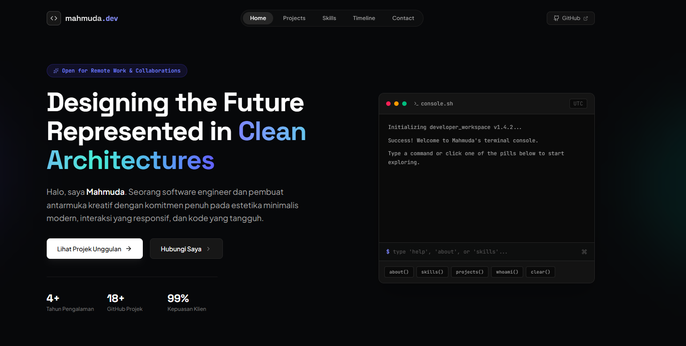

# Mahmuda - Minimalist Portfolio
## 📸 Tampilan Website

Selamat datang di repository portofolio pribadi saya! Website ini merupakan ruang digital untuk menampilkan perjalanan karier, proyek teknis, dan keahlian saya sebagai lulusan S1 Informatika.

## 🌟 Tentang Saya
Lulusan S1 Informatika dari Universitas Mulawarman (2024). Memiliki ketertarikan besar pada pengembangan aplikasi web, integrasi data (ETL Pipeline), dan teknologi cloud. Saya berdomisili di Penajam Paser Utara, Kalimantan Timur dan sangat antusias untuk berkontribusi dalam solusi teknologi yang inovatif.

## 🛠 Tech Stack
* **Languages:** TypeScript, JavaScript, SQL
* **Frameworks/Libraries:** React, Express.js, Tailwind CSS
* **Tools:** Git, Vite, Node.js
* **Cloud & AI:** Google Cloud, Azure AI

## 🚀 Proyek Unggulan
* **Personal Portfolio Website:** Website yang Anda kunjungi ini, dibangun menggunakan React, Vite, dan Tailwind CSS.
* **ETL Pipeline Project:** Implementasi alur kerja data dari ekstraksi hingga loading untuk keperluan analitik.
* **Bookshelf App:** Aplikasi untuk mengelola koleksi buku dengan fitur CRUD dasar.

## 🏆 Pencapaian
* **Juara 3** Sayembara Desain Logo Universitas Mulawarman (2024).
* **Ex Fasilitator** Google Cloud Arcade (Juli – September 2025).

## 🔗 Hubungi Saya
* **Website:** [Klik di sini untuk melihat portfolio live](https://mahmuda-portofolio-q2c13y763-mahmuda1004-1917s-projects.vercel.app/)
* **GitHub:** [github.com/mahmuda1004](https://github.com/mahmuda1004)

---
*Dibuat oleh Mahmuda | Lulusan S1 Informatika, Universitas Mulawarman.*
